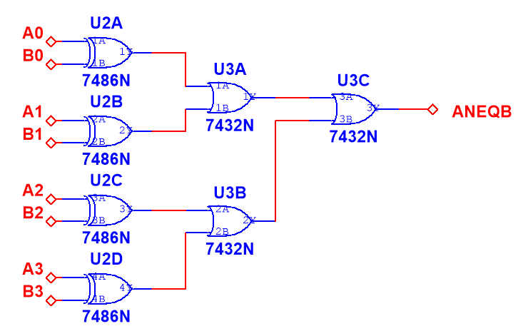
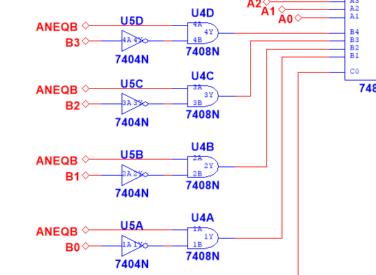

# 4-bit Conditional Arithmetic Unit

## Repository Structure
```
4bit-conditional-arithmetic/
│
├── docs/                        # Documentation
│   ├── adder-7483.png           # 7483 adder circuit
│   ├── b-processing.png         # B conditioning circuit
│   ├── carry-management.png     # Carry-out management
│   ├── display-output.png       # 7448 display circuit
│   └── equality-detection.png   # A=B comparison circuit
│
├── pcb/                         # PCB design files
│   ├── PCB_ConditionalArithmetic_COPPER.pdf      # Copper layer
│   ├── PCB_ConditionalArithmetic.pdf             # PCB layout
│   ├── PCB_ConditionalArithmetic_SILK.pdf        # Silkscreen
│   ├── PCB_ConditionalArithmetic_YYYY-MM-DD.zip  # Gerber files
│   └── pcb-design.png           # PCB preview image
│
├── schematic/                   # Circuit design
│   ├── block-diagram.png        # System block diagram
│   └── circuit-complete.pdf     # Full schematic (EasyEDA)
│
├── simulation/                  # Multisim simulations
│   ├── 4bit-conditional-arithmetic.ms14    # Multisim project file
│   ├── timing-analysis.png      # Timing simulation results
│   └── truth-table-verify.png   # Truth table verification
│
├── LICENSE                      # MIT License
├── README.md                    # This documentation file
```

## Overview
This circuit implements an arithmetic unit that performs different operations based on the relationship between two 4-bit binary numbers (A and B), where A ≥ B is always true. The design optimizes component usage while implementing complex conditional arithmetic logic.

## Functionality
The circuit performs the following conditional operations:

1. **When A = B**:  
   `Z = A + 1`

2. **When A > B**:  
   `Z = (A - B) - 1`

[](docs/block-diagram.png)

## Design Architecture

### 1. Input Section
- **DIP switches** for 4-bit inputs A[3:0] and B[3:0]
- Manual binary configuration with pull-up resistors

### 2. Equality Detection Circuit
- **Components**: 7486 (Quad XOR) + 7432 (Quad OR)
- **Logic**: Bitwise XOR between A and B determines equality
- **Output**: `ANEQB` (A Not EQual to B) = 1 when A ≠ B
- **Implementation**: 4 XOR gates feed into OR gate

[](docs/equality-detection.png)

### 3. Input Processing Stage
- **Components**: 7404 (Hex NOT) + 7408 (Quad AND)
- **Logic**: `B_processed = ANEQB * B'`
  - When A = B: All bits of B are forced to 0
  - When A > B: Each bit of B is inverted
- **Efficiency**: Uses 4 NOT gates and 4 AND gates

[](docs/b-processing.png)

### 4. Core Arithmetic Unit
- **Component**: 7483 4-bit Binary Adder
- **Input A**: Direct connection (A₃A₂A₁A₀)
- **Input B**: Connected to processed B values
- **Carry-in (C₀)**: Controlled by `ANEQB'` signal
  - When A = B: `C₀ = 1` → Implements `A + 1`
  - When A > B: `C₀ = 0` → Implements `A + B'`

[](docs/adder-7483.png)

### 5. Carry-Out Management
During testing, the circuit exhibited an unexpected carry-out (C₄) when A ≠ B. To optimize component usage, an alternative implementation was developed:

- Uses remaining NOT gate from 7404 for `ANEQB'`
- Implements `C₄_corrected = C₄ · ANEQB'` with diode-resistor logic
- 1kΩ pull-up resistor ensures proper current for 7448 decoders

[](docs/carry-management.png)

### 6. Output Display
- **Component**: 7448 BCD to 7-segment decoders
- Common cathode 7-segment displays
- Shows 4-bit results in hexadecimal

[](docs/display-output.png)

## Mathematical Formulation

### Case A = B:
```
Z = A + 1
  = A + 0 + 1 (B_processed = 0, C₀ = 1)
```

### Case A > B:
```
Z = (A - B) - 1
  = A + (~B + 1) - 1  (two's complement)
  = A + ~B            (simplified)
  = A + B_processed   (B_processed = ~B, C₀ = 0)
```

Both cases reduce to: `Z = A + B_processed + C₀`

## Simulation Results

[](simulation/timing-analysis.png)

[](simulation/truth-table-verify.png)

## Truth Table (Selected Cases)

| Condition | A (Hex) | B (Hex) | Operation | Result (Hex) |
|-----------|---------|---------|-----------|--------------|
| A = B     | 0x0     | 0x0     | 0 + 1     | 0x1          |
| A = B     | 0x5     | 0x5     | 5 + 1     | 0x6          |
| A = B     | 0xF     | 0xF     | F + 1     | 0x0*         |
| A > B     | 0x5     | 0x3     | (5-3)-1   | 0x1          |
| A > B     | 0x8     | 0x6     | (8-6)-1   | 0x1          |
| A > B     | 0xF     | 0x0     | (F-0)-1   | 0xE          |

*Note: Result with C₄ = 1 (16 in decimal)*

## Component Utilization

| IC | Type | Gates Used | Purpose |
|----|------|------------|---------|
| 7486 | Quad XOR | 4/4 | Equality comparison |
| 7432 | Quad OR | 3/4 | Combine XOR results |
| 7404 | Hex NOT | 5/6 | Signal inversion |
| 7408 | Quad AND | 4/4 | Conditional B processing |
| 7483 | 4-bit Adder | Full | Arithmetic core |
| 7448 | BCD-7seg | As needed | Display output |
| Diode+1kΩ | Discrete | Custom | Carry-out conditioning |

## PCB Design

[](pcb/pcb-design.png)

The PCB includes:
- **Gerber files**: Ready for manufacturing (in .zip archive)
- **Copper layers**: Top and bottom copper views
- **Silkscreen**: Component labels and indicators
- **3D view**: Physical board visualization

## Getting Started

### 1. Review Design Files
- Check `schematic/circuit-complete.pdf` for full circuit
- Review `simulation/4bit-conditional-arithmetic.ms14` for simulation

### 2. Manufacturing
- Use `pcb/PCB_ConditionalArithmetic_YYYY-MM-DD.zip` for PCB fabrication
- Refer to PCB layout PDFs for assembly guidance

## Design Principles

This implementation demonstrates:
- **Component Efficiency**: Maximizing gate utilization
- **Functional Integration**: Multiple operations in single stages
- **Resource Optimization**: Discrete components reduce IC count
- **Signal Integrity**: Proper resistor selection for current drive

The circuit successfully implements complex conditional arithmetic using minimal TTL components while maintaining reliable operation across all input conditions.
